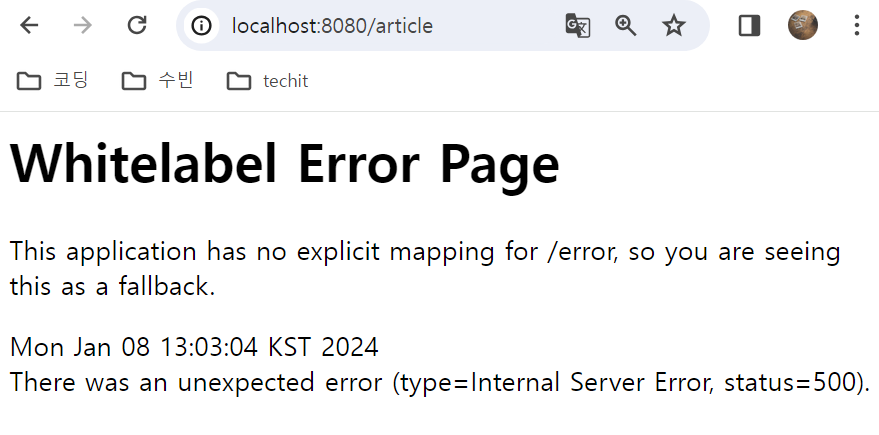

# 익명 의견 교환 웹 페이지 프로젝트

## 프로젝트 개요
- 사용자들이 자기 자신의 정보를 직접 드러낼 필요 없이 의견을 교환할 수 있는 웹 페이지 구현
- 자신이 누군지 드러낼 필요는 없지만 작성한 사람이 원한다면 수정, 삭제는 가능해야 함

## 필수 기능 엔드포인트 (제안)

- 게시판 보기: `/boards/{:boardId}/`
- 게시글 작성하기: `/boards/{:boardId}/article/`
- 게시글 보기: `/article/{:articleId}`
- 게시글 수정하기: `/article/{:articleId}/update/`
- 게시글 삭제하기: `/article/{:articleId}/delete/`
- 댓글 작성하기: `/article/{:articleId}/comment/`
- 댓글 삭제하기: `/article/{:articleId}/comment/{:commentId}/delete/`

## 기능 설명
### 게시판 관련 기능
- 게시판은 같은 주제의 게시글을 모아 둔 단위
- 게시판의 목록, 선택된 게시판의 게시글 목록을 볼 수 있는 화면
  - 게시판 목록의 링크를 선택하면 
    - 해당 게시판에 작성된 게시글 제목만 목록으로 출력되는 화면
  - 전체 게시글을 위한 전체 게시판이 존재
  - 게시글 제목은 링크
    - 해당 게시글의 정보를 전부 조회할 수 있는 페이지로 이동
  - 조회되는 게시글들은 항상 나중에 작성된 게시글이 최상단에 작성
- 게시판 종류: 자유게시판, 개발 게시판, 일상 게시판, 사건사고 게시판

### 게시글 관련 기능
- 하나의 주제에 대한 의견을 교환하기 위한 글
  - 제목, 내용으로 구성
  - 게시글이 작성되는 게시판이 존재
- 게시글 작성
  - 게시글 작성 페이지 필요
  - 어떤 게시판에 작성할지를 선택 가능
  - 게시글의 제목과 내용 작성
  - 게시글의 내용 자체는 plain text
  - 작성자가 자신임을 증명할 수 있는 비밀번호 추가
- 게시글 단일 조회 화면이 필요
  - 댓글 관련기능은 이 화면에 포함
    - 댓글 목록, 댓글 추가, 댓글 삭제
  - 게시글 삭제를 위한 ui 존재
- 게시글 수정
  - 게시글 수정하는 페이지 필요
  - 수정 페이지에는 본래 제목, 글이 존재
  - 게시글 수정을 위해 비밀번호를 제출할 수 있어야 한다
    - 작성당시 비밀번호와 일치해야 실제로 수정 
- 게시글 삭제
  - 단일 게시글 조회 페이지의 삭제ui이용
  - 삭제를 위해 비밀번호 제출
    - 작성당시 비밀번호와 일치해야 실제로 삭제 

### 댓글 관련 기능

### 오류
- 1. 실행했을 때 오류가 발생함
   - articleController에서 클래스 위의 @RequiredMapping("article")이라고 작성한 뒤 다른 프로젝트 처럼 return "article/index";로 작성했는데 접속오류가 발생했다.
   - return부분에 article 부분을 지우니 잘 실행된다.

